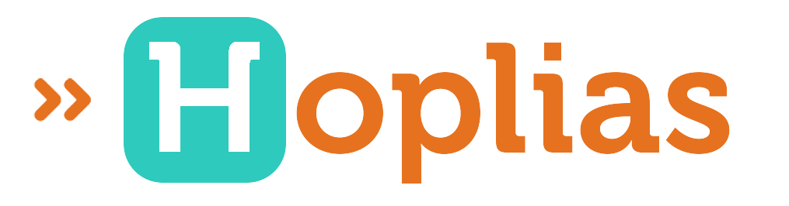
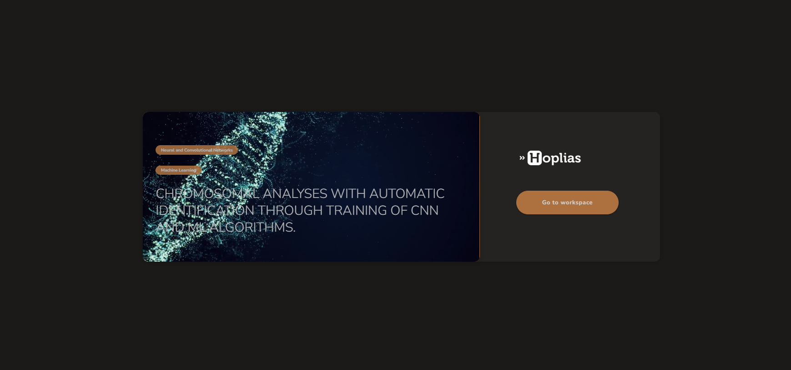
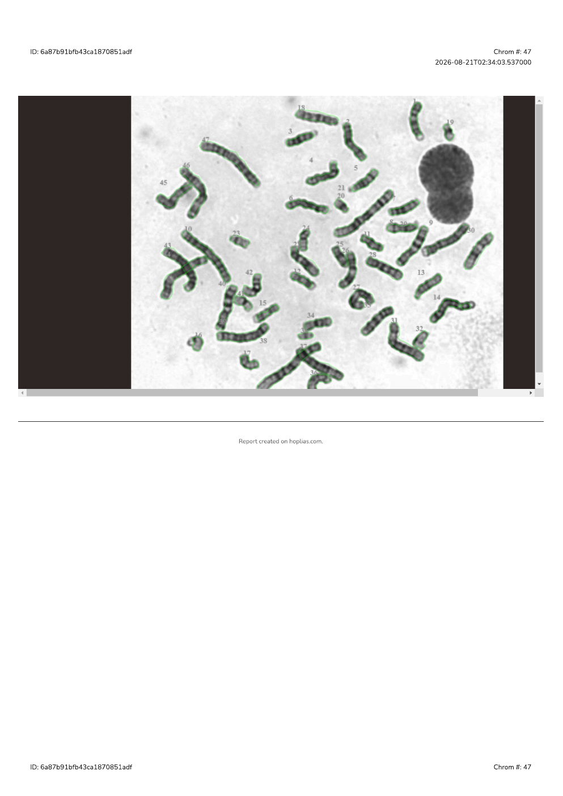
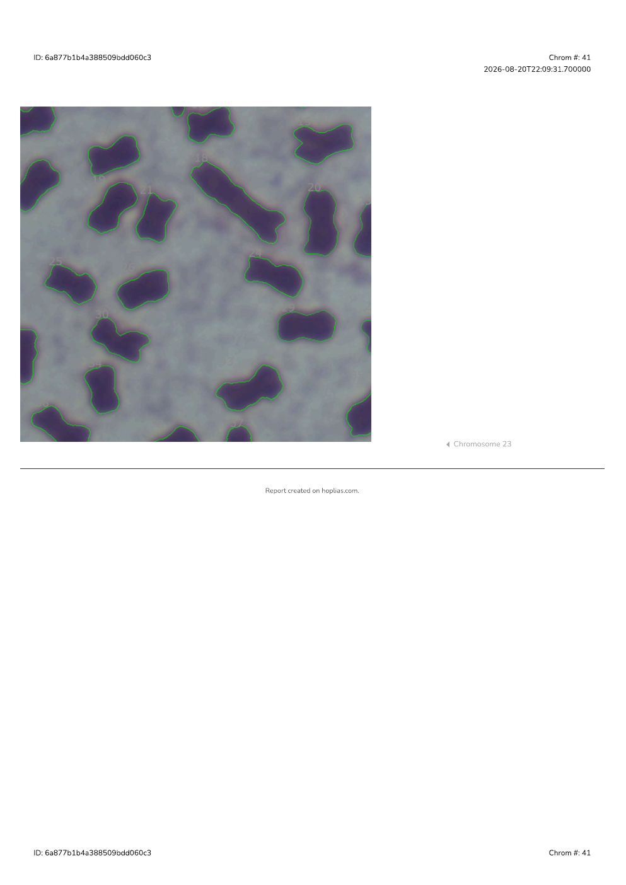
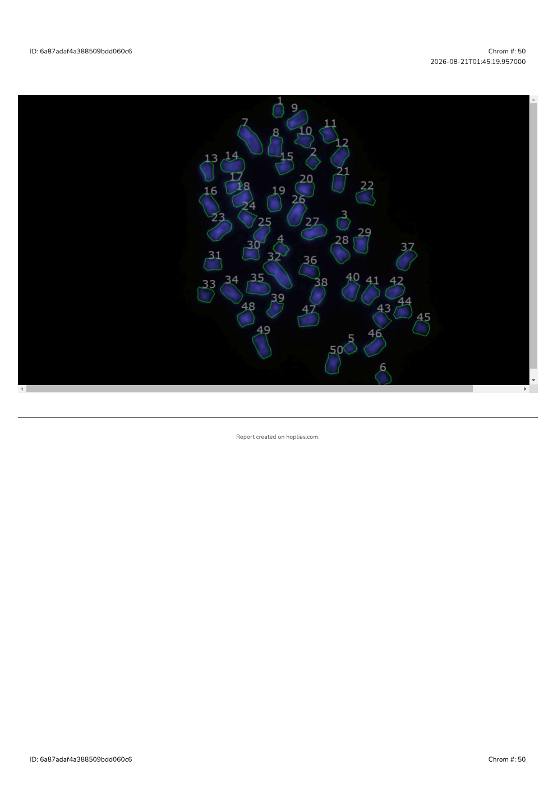

#  Hoplias v1.0.0 alpha

  

*Hoplias - Web Toolkit For Automated Kariotype Assembly and Chromosomal Analysis*

######  gui status ####

  <a href="https://hoplias.com" target="_blank">
    
     
    <b>🔗 hoplias.com</b>
  </a>

## ▶️ Demos

Click **Play** to start the video.

<table>
  <tr>
    <td align="center" width="33%">
      <strong>Human</strong> 
       
      
    </td>
    <td align="center" width="33%">
      <strong>Fish</strong> 
       
      
    </td>
    <td align="center" width="33%">
      <strong>Fish</strong> 
       
      
    </td>
  </tr>
</table>

## 📄 Reports

Sample karyotype reports generated by Hoplias. Click a preview to open the PDF.

<table>
  <tr>
    <td align="center" width="33%">
      <strong>Human</strong> 
       
      
    </td>
    <td align="center" width="33%">
      <strong>Fish</strong> 
       
      
    </td>
    <td align="center" width="33%">
      <strong>Fish</strong> 
       
      
    </td>
  </tr>
</table>

## Downloads

### Specific versions
| Plataforma     | Arquivo    | Download                                                                                      |
|----------------|------------|-----------------------------------------------------------------------------------------------|
| Windows .exe   | Installer  | [Hoplias gui Setup 1.0.0-alpha.exe](./gui/dist_win/Hoplias%20gui%20Setup%201.0.0-alpha.exe)   |
| macOS  .zip    | Zip        | [Hoplias gui-1.0.0-alpha-mac.zip](./gui/dist_mac/Hoplias%20gui-1.0.0-alpha-mac.zip)           |
| Linux .deb     | AppImage   | [hoplias-gui_1.0.0-alpha_amd64.de](./gui/dist_linux/hoplias-gui_1.0.0-alpha_amd64.deb)        |
| Linux  .tar    | AppImage   | [hoplias-gui-1.0.0-alpha.tar.xz](./gui/dist_linux/hoplias-gui-1.0.0-alpha.tar.xz)             |

---

### 🚀 Main Features General

- [Feature or module] — Initial login interface using basic credentials (email and password) with email validation.
- [Service Integration] — Login interface using Google Login service.
- [Feature or module] — Initial interface with shortcuts and image input entry point.
- [Feature or module] — Main karyotype editor interface, with image insertion as the first step.
- [Feature or module] — Component for identifying chromosomes in microscopy images with advanced threshold segmentation parameter adjustment.
- [Feature or module] — Component for manual chromosome identification using polygon drawing tools.
- [Feature or module] — Component for manual adjustment of centromeric index and chromosome rotation.
- [Feature or module] — Component for visualizing karyotype assembly, with chromosome adjustment and pairing tools. Classification adjustment and open area for inputting extra analysis data.
- [Feature or module] — Component for viewing the karyotype assembly report.
  - Card for viewing metaphase with polygons and chromosome identification labels.
  - Card for viewing and adjusting the analysis and printing layout.
  - Card for viewing the resulting ideogram/karyogram.
  - Card for viewing the chromosome measurement table.
  - Export to PDF function.
- [Service Integration] — Integration with AWS S3 cloud storage.
- [Service Integration] — Integration with GCP cloud storage.
- [Service Integration] — Integration with Google Drive storage.
- [Feature or module] — Interface for editing or viewing ideograms/karyograms.
- [Feature or module] — Interface for listing and managing ideogram/karyogram data.
- [Feature or module] — Interface for listing and managing karyotype data.
- [Feature or module] — Page for modifying system access.
- [Feature or module] — FAQ page.
- [Feature or module] — Multilingual component available in 8 languages (Portuguese, English, Spanish, French, Mandarin, Hindi, Arabic, Bengali).

## 🚀 Features resumed

### Authentication & Access
- ✨ Login via email and password with email validation.
- 🔐 Integration with Google Login service.

### Karyotype Workflow
- 🧬 Initial dashboard with shortcuts and image input entry point.
- 🧬 Main karyotype editor: upload microscopy image as the first step.
- 🔍 Automatic chromosome detection with adjustable segmentation thresholds.
- ✏️ Manual chromosome identification using polygon drawing tools.
- 🧭 Manual centromere index adjustment and chromosome rotation.
- 🧷 Karyotype assembly view with:
  - Chromosome alignment and pairing.
  - Classification options and notes section for additional analysis.

### Reports & Visualization
- 📄 Karyotype report component including:
  - Metaphase image with overlays and chromosome labels.
  - Print-ready layout preview and export.
  - Final ideogram/karyogram.
  - Chromosome measurement table.
  - PDF export functionality.

### Data Management
- 📁 Interface for ideogram/karyogram editing and viewing.
- 📂 Management pages for karyotypes and ideograms.
- ⚙️ Page for user access modifications.
- ❓ FAQ/help section.

### Cloud Integration
- ☁️ AWS S3 storage integration.
- ☁️ Google Cloud Platform (GCP) storage integration.
- ☁️ Google Drive storage integration.

### Internationalization
- 🌐 Multilingual support in 8 languages:  
  Portuguese, English, Spanish, French, Mandarin, Hindi, Arabic, Bengali.

---

## 🔒 Security Improvements

- ✅ JWT-based authentication with token expiration handling.
- 🧱 Updated dependencies to patch known vulnerabilities.
- 🧪 Improved validation for malformed input files.

---

## 📦 Distribution

- [ ] Source code available as `.zip` and `.tar.gz` archives.

---

## 👥 Credits

Special thanks to:

- **Laboratório de Genômica da UFV - CRP**
- **UFV, UFSCar**
- Jean-Patrick Pommier  
- Matheus Lewi Bonaccorsi  
- Francisco Sassi  
- João Fernando Mari

---

## 📚 Scientific references

The following are the scientific articles used as a basis for the development of the current version:

1. **A comparison between two approaches to segment overlapped chromosomes in microscopy images**  
   📎 [Baixar PDF](./docs/1-A-comparison-between-two-approaches-to-segment-overlapped-chromosomes-in-microscopy-images.pdf)  
   ✍️ *Rodrigo Júnior Rodrigues, Welton Felipe Gonçalves, João Fernando Mari* – WVC, 2017

2. **Improving the definition of markers for the watershed transform by combining h-maxima transform and convex-hull**  
   📎 [Baixar PDF](./docs/1.1-improving_markers_watershed_transform.pdf)  
   ✍️ *Welton Felipe Gonçalves, Rodrigo Júnior Rodrigues, João Mari* – WVC, 2017

3. **Segmentation of fish chromosomes in microscopy images: A new Dataset**  
   📎 [Baixar PDF](./docs/2-segmentation_fish_chromosomes_dataset.pdf)  
   ✍️ *Rodrigo Júnior Rodrigues, Rubens Pasa, Karine Frehner Kavalco, João Fernando Mari* – WVC, 2019

4. **HOPLIAS: An Accessible Web Toolkit for Automated Karyotype Assembly**  
   📎 [Baixar PDF](./docs/3-hoplias_web_toolkit_xmeeting2024.pdf)  
   📘 ISBN: 978-65-272-0843-3
   📘 DOI: 10.13140/RG.2.2.26659.98083 
   ✍️ *Rodrigo Júnior Rodrigues, Matheus Lewi Cruz Bonaccorsi De Campos, Francisco De Menezes Cavalcante Sassi* – X-Meeting, 2024

6. **Hoplias: An accessible web toolkit for automated Karyotype assembly based on client-server architecture**  
   📎 [Baixar PDF](./docs/#)  
   ✍️ *Rodrigo Júnior Rodrigues, Matheus Lewi Cruz Bonaccorsi De Campos, Francisco De Menezes Cavalcante Sassi, Rubens Pasa, Karine Frehner Kavalco, João Fernando Mari* – 2025

---

## Development mode
## 🛠️ Development Guide

### Quick Start
1. Read our [Project Overview](./docs/PROJECT_OVERVIEW.md)
2. Check the [Development Setup Guide](./docs/DEVELOPMENT_SETUP.md)
3. Review [Code Standards](./docs/templates/CODE_STANDARDS.md)

### Contributing
1. 📋 [Contributing Guidelines](./docs/CONTRIBUTING.md)
2. 🔄 [Git Workflow](./docs/templates/CONVETIONAL_COMMITS.md)
3. 📝 [Pull Request Template](./.github/PULL_REQUEST_TEMPLATE.md)

### Microservices Documentation
Each service has its own setup and guidelines:

- 🖥️ [GUI Service](./gui/README.md)
- 🎯 [Core Service](./core/README.md)
- 📦 [API Service](./api/README.md)

### Additional Resources
- 📚 [API Documentation](./docs/API.md)
- 🧪 [Testing Guide](./docs/TESTING.md)
- 🚀 [Deployment Guide](./docs/DEPLOYMENT.md)

### Starting projet
1. 🚀 Install docker
2. ✅ run comand `./stat_hoplias.sh`

### Generate build unified
`docker build -f Dockerfile.unified -t hoplias-toolkit-v1.0.0-alpha-1 .`
- for start image `docker run --privileged hoplias-toolkit-v1.0.0-alpha-1`

❤️ Enjoy

✅ **End of Document**
