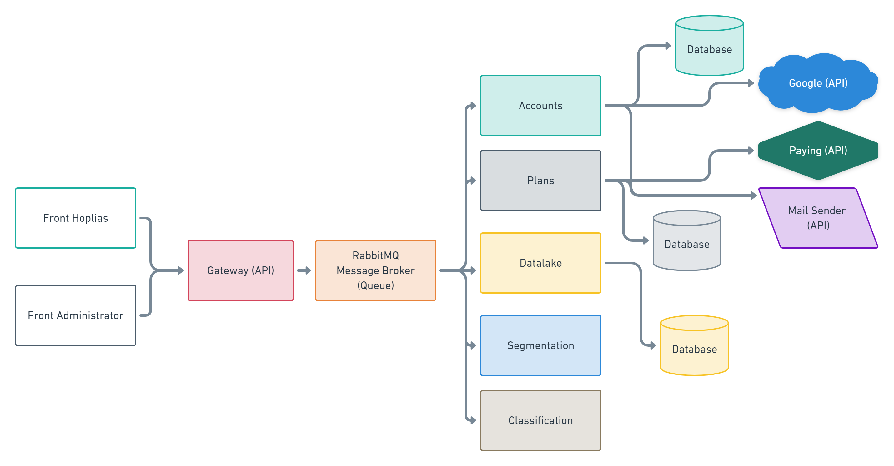

# API Gateway
API Gateway for MicrosServices Hoplias



## Installation
  - Install [Python](https://www.python.org/downloads/), [Pipenv](https://docs.pipenv.org/) 
  - Install RabbitMQ 
  ``` docker run -d --hostname my-rabbit --name rabbit13 -p 8080:15672 -p 5672:5672 -p 25676:25676 rabbitmq:3-management ```

  - Activate the project virtual environment with `$ pipenv shell`
  - `pip install -r requirements.txt` to install dependencies
  - Start the app with `python run.py`


## Compatibility
* [Tested on Python 2.7]

Notes
=================
